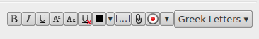
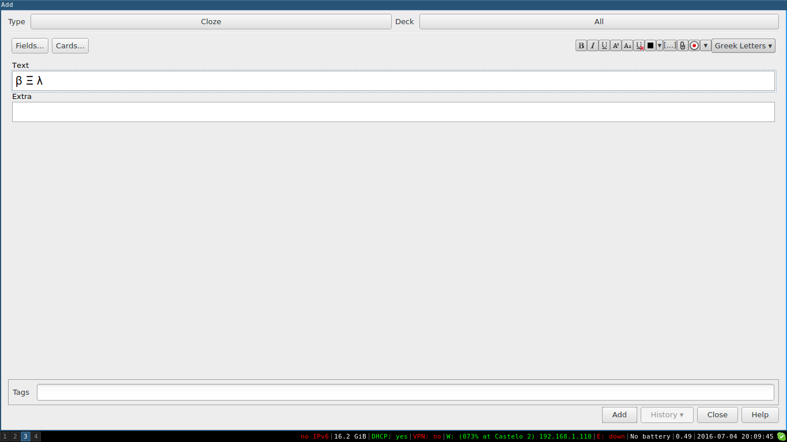

# Anki Greek Letters

Add a Greek Letters menu to Anki Card editor. Info on how to install this addon [available here](https://ankiweb.net/shared/info/556931341).

## Known issues
When I started writing this addon I had big plans, but right now I don't have time to finish it as I would like to. I'm releasing because this way someone can use my code / idea to create better addons.

* Letters will be added after the whole text in the current selected field, don't matter the position of the cursor in the Editor.
* Poor design and visual.

## About
Created by [Fernando Paladini](@paladini). Licensed under GNU GPL V3.
